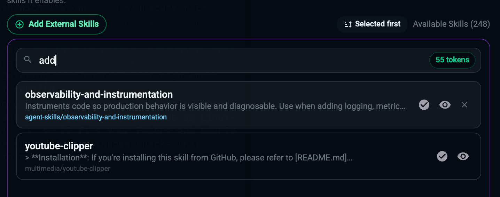

# Using agent-skills with Dojo Workspace

## Install for all projects

1. Open the **Skills** panel and click **Add External Skills**.
2. Enter `addyosmani/agent-skills` (or the full GitHub URL) and click **Install**.

The skills appear in the panel under the `agent-skills` bucket. Tick the checkmark next to each skill you want to enable for that lane (Dojo Solo or Dojo Duo). Search `agent-skills` to list them all.

## Use in a single project

Place any skill folder (the folder containing its `SKILL.md`) in your project's `.agents/skills/` directory. Dojo lists those skills automatically for that project only, marked **Always on** in the Skills panel.

## How skills load

Only each skill's name and description are listed for the model. The full `SKILL.md` loads on demand when a task matches, so enabling many skills stays cheap. Dojo also reads project instructions from `AGENTS.md`.
