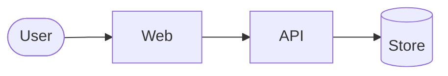

# Architecture

The whole system on one page. Anyone with a relevant skill may edit it. Contracts are not written here: use the SDK to get the types. Updated when a service or surface is added, removed, or changes responsibility.

## Project structure

```text
<monorepo layout: apps, services, packages, sdk at the root, infra>
```

## Tech stack

| Layer | Choice |
|---|---|
| Backend | |
| Web | |
| Mobile | |
| Database | |
| Infra | |
| Observability | |

## Features

One line each; detail in [PRD.md](PRD.md).

| Feature | Services | PRD |
|---|---|---|

## API reference

Swagger: `<link>`. Typed clients: `<sdk path at the repository root>`.

## Surfaces

- [BACKEND-ARCHITECTURE.md](BACKEND-ARCHITECTURE.md)
- [WEB-ARCHITECTURE.md](WEB-ARCHITECTURE.md)
- [MOBILE-ARCHITECTURE.md](MOBILE-ARCHITECTURE.md)

## Shape of the system



Services and the direction of dependence only.
